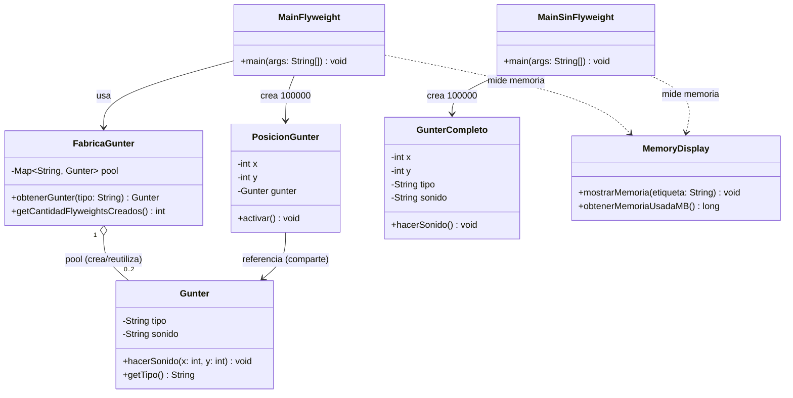

# El Ejército de Gunters del Rey Helado — Patrón Flyweight

Taller de aplicación del patrón de diseño **Flyweight** en Java.

## Contexto

El Rey Helado quiere formar un ejército de **100 000 pingüinos Gunter** para invadir Ooo. Crear cada pingüino como un objeto completo agota la memoria antes de terminar el ejército. Este proyecto resuelve el problema aplicando **Flyweight**, y además incluye una segunda versión *sin* el patrón para comparar el consumo de memoria entre ambas.

## Estructura del proyecto

```
ejercito-gunters/
├── src/
│   ├── flyweight/            # Versión CON el patrón Flyweight
│   │   ├── Gunter.java           (Flyweight)
│   │   ├── PosicionGunter.java   (Contexto)
│   │   ├── FabricaGunter.java    (Fábrica Flyweight)
│   │   └── MainFlyweight.java    (Cliente)
│   ├── sinflyweight/          # Versión SIN el patrón (control de comparación)
│   │   ├── GunterCompleto.java
│   │   └── MainSinFlyweight.java
│   └── util/
│       └── MemoryDisplay.java # Utilidad para medir memoria de la JVM
├── bin/                       # Clases compiladas (.class)
└── README.md
```

## Identificación de estado intrínseco / extrínseco

| Estado | Dato | Dónde vive |
|---|---|---|
| **Intrínseco** (compartido, repetible) | `tipo` ("Normal" / "Con sombrero"), `sonido` ("Wenk") | `Gunter` (Flyweight) |
| **Extrínseco** (único por instancia) | posición `x`, `y` | `PosicionGunter` (Contexto), pasado como parámetro a `hacerSonido(x, y)` |

Como solo existen **2 combinaciones** de estado intrínseco, la fábrica nunca necesita crear más de 2 objetos `Gunter`, sin importar si se simulan 500 o 100 000 posiciones.

## Diagrama de clases UML



**Roles del patrón:**
- **Flyweight** → `Gunter`
- **Contexto** → `PosicionGunter`
- **Fábrica Flyweight** → `FabricaGunter`
- **Cliente** → `MainFlyweight`

## Cómo ejecutar

Requiere JDK 17+.

```bash
# Compilar
javac -encoding UTF-8 -d bin $(find src -name "*.java")

# Ejecutar la versión CON Flyweight
java -Dstdout.encoding=UTF-8 -cp bin flyweight.MainFlyweight

# Ejecutar la versión SIN Flyweight
java -Dstdout.encoding=UTF-8 -cp bin sinflyweight.MainSinFlyweight
```

> **Nota:** la bandera `-Dstdout.encoding=UTF-8` solo es necesaria si tu terminal no usa UTF-8 por defecto (se ve como `posici?n` en vez de `posición`). En la mayoría de terminales modernos no hace falta.

Ambas versiones simulan **100 000 Gunters**, alternando entre los 2 tipos, e imprimen por consola el sonido y posición de cada uno (salida larga por diseño del ejercicio), seguido del resumen final:

```
Wenk! Gunter Normal en posición (12, 45)
Wenk! Gunter Con sombrero en posición (67, 3)
...
Total de pinguinos simulados: 100000
Total de objetos Flyweight (Gunter) creados: 2
```

## Explicación del uso del patrón

- `FabricaGunter` mantiene un `HashMap<String, Gunter>` como *pool*. Cuando `MainFlyweight` pide un Gunter de un tipo, la fábrica revisa si ya existe en el mapa: si existe lo devuelve, si no lo crea una única vez y lo guarda.
- Cada una de las 100 000 posiciones generadas crea un objeto **liviano** `PosicionGunter`, que solo guarda `x`, `y` y una **referencia** al Flyweight compartido — nunca una copia del tipo ni del sonido.
- Al llamar `activar()`, el Contexto invoca `hacerSonido(x, y)` en el Flyweight, inyectándole el estado extrínseco en tiempo de ejecución.
- El resultado: **100 000 posiciones simuladas, pero solo 2 objetos `Gunter` creados en toda la ejecución.**
- La versión de control (`sinflyweight`) usa `GunterCompleto`, que guarda tipo y sonido repetidos en cada una de las 100 000 instancias, sin ningún pool ni reutilización — de ahí el mayor consumo de memoria.

## Resultados de memoria (medidos con `MemoryDisplay`)

Medición tomada con `Runtime.getRuntime()` (memoria usada = memoria total asignada − memoria libre), antes y después de construir el ejército de 100 000 Gunters, en las mismas condiciones para ambas versiones.

|                                   | Con Flyweight | Sin Flyweight |
|-----------------------------------|:-------------:|:--------------:|
| Objetos de gran tamaño creados     | 2 (`Gunter`)  | 100 000 (`GunterCompleto`) |
| Memoria antes de crear el ejército | 1 MB          | 1 MB           |
| Memoria después de crear el ejército | 3 MB        | 4 MB           |
| **Memoria consumida (MB)**         | **2 MB**      | **3 MB**       |

**Conclusión:** con Flyweight, el árbol de 100 000 posiciones solo requiere 2 objetos "pesados" (los `Gunter` con su tipo y sonido); todo lo demás son referencias livianas. Sin Flyweight, cada uno de los 100 000 Gunters duplica innecesariamente su tipo y sonido, aumentando el consumo total de memoria. La diferencia relativa aquí es moderada porque el estado intrínseco de este ejercicio (dos `String`) es pequeño; en un caso real (por ejemplo, si el estado intrínseco fuera una textura o sprite de varios KB por Gunter), el ahorro de Flyweight sería drásticamente mayor.

## Entregables cubiertos

1. ✅ Diagrama de clases UML — sección anterior (Mermaid).
2. ✅ Código fuente — este repositorio, con paquetes `flyweight/` y `sinflyweight/` separados.
3. ✅ Explicación del uso del patrón — sección "Explicación del uso del patrón".
4. ✅ Tabla de uso de memoria — sección "Resultados de memoria".
